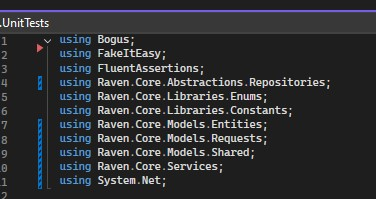
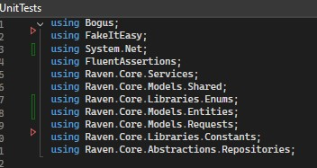

# Line Up

Line Up is a simple, lightweight Visual Studio extension that tidies up your code by rearranging selected lines in ascending order of length—giving your code blocks a clean, triangular aesthetic, if you're into that kinda thing 😉. Just select the lines you want to rearrange and hit Ctrl + Shift + R!

Before Ctrl + Shift + R:

After Ctrl + Shift + R:

